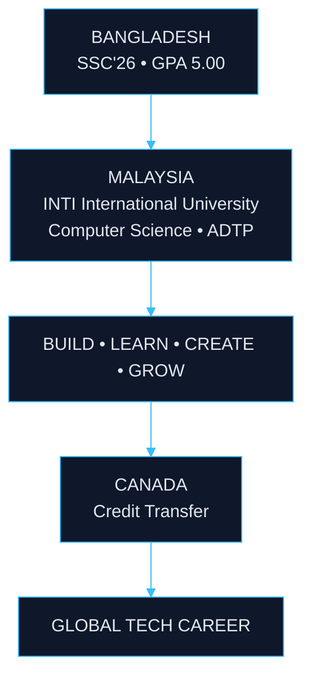

 

&nbsp;

&nbsp;

&nbsp;

  

<a href="#about"><b>ABOUT</b></a> &nbsp;·&nbsp;
<a href="#blueprint"><b>BLUEPRINT</b></a> &nbsp;·&nbsp;
<a href="#focus"><b>FOCUS</b></a> &nbsp;·&nbsp;
<a href="#projects"><b>PROJECTS</b></a> &nbsp;·&nbsp;
<a href="#roadmap"><b>ROADMAP</b></a> &nbsp;·&nbsp;
<a href="#github"><b>GITHUB</b></a> &nbsp;·&nbsp;
<a href="#connect"><b>CONNECT</b></a>

 

---

<h2 align="center"><code>01</code> — ABOUT</h2>

<table>
<tr>
<td width="65%" valign="top">

### Hello, I'm Arpon.

I'm a **Computer Science student from Bangladesh** building my foundation across **software development, artificial intelligence, web technologies, and digital products**.

I completed **SSC'26 with GPA 5.00** and am pursuing an international academic path toward **Computer Science at INTI International University, Kuala Lumpur** through the American Degree Transfer Program.

My long-term direction is **Canada**, with the goal of developing a global career in technology through continuous learning, real-world projects, and meaningful opportunities.

I believe in **learning by building** — turning ideas into products, experimenting with technology, documenting the process, and improving through execution.

</td>
<td width="35%" valign="middle" align="center">

<b>ARPON CHAKRABORTY</b>
  
🇧🇩 &nbsp;Bangladesh 
🇲🇾 &nbsp;Malaysia 
🇨🇦 &nbsp;Future Direction
  
<b>GPA</b> 
<b>5.00</b>
  
<b>FOCUS</b> 
CS • AI • Tech
  
<b>BUILDING</b> 
Projects • Skills • Future

</td>
</tr>
</table>

---

<h2 align="center"><code>02</code> — IDENTITY</h2>

  

---

<h2 align="center"><code>03</code> — THE BLUEPRINT</h2>

<b>GLOBAL CAREER BLUEPRINT</b>

---

<h2 align="center"><code>04</code> — CURRENT FOCUS</h2>

<table>
<tr>
<td align="center" width="25%" valign="top">

<h3>💻</h3>
<b>COMPUTING</b>
  
Computer Science 
Programming 
Software Development

</td>
<td align="center" width="25%" valign="top">

<h3>🤖</h3>
<b>AI</b>
  
AI-Assisted Coding 
Artificial Intelligence 
Experimentation

</td>
<td align="center" width="25%" valign="top">

<h3>🌐</h3>
<b>BUILDING</b>
  
Web Development 
Digital Products 
Real Projects

</td>
<td align="center" width="25%" valign="top">

<h3>🌍</h3>
<b>DIRECTION</b>
  
Malaysia 
Credit Transfer 
Canada

</td>
</tr>
</table>

---

<h2 align="center"><code>05</code> — PROJECTS</h2>

<table>
<tr>
<td align="center" width="50%" valign="top">

<h3>◈ EASY LIFE BD</h3>
<b>E-Commerce Platform</b>
  
A modern e-commerce project focused on creating a clean, convenient and structured online shopping experience.
  
<b>WEB DEVELOPMENT · UI/UX · AI-ASSISTED CODING</b>

</td>
<td align="center" width="50%" valign="top">

<h3>◈ STORAGE BANK</h3>
<b>Cloud Storage Platform</b>
  
A cloud-storage project focused on file management, digital storage and a simple, intuitive user experience.
  
<b>CLOUD · SOFTWARE · WEB DEVELOPMENT</b>

</td>
</tr>
</table>

 

<i>More projects are being built.</i> &nbsp;→&nbsp; <a href="https://github.com/arponofficial01?tab=repositories"><b>All repositories</b></a>

---

<h2 align="center"><code>06</code> — DEVELOPMENT PHILOSOPHY</h2>

---

<h2 align="center"><code>07</code> — ROADMAP</h2>

<table>
<tr>
<td width="33%" valign="top">

<b>2026</b>
  
✓ SSC'26 
✓ GPA 5.00 
✓ Begin CS Foundation 
✓ Start Building Projects 
✓ Develop GitHub Portfolio

</td>
<td width="34%" valign="top">

<b>2027+</b>
  
○ Computer Science • Malaysia 
○ Programming &amp; Software Development 
○ AI &amp; Emerging Technologies 
○ Open Source 
○ Real-World Projects 
○ International Opportunities

</td>
<td width="33%" valign="top">

<b>LONG TERM</b>
  
○ Credit Transfer → Canada 
○ Advanced Computer Science 
○ Global Technology Career 
○ Entrepreneurship

</td>
</tr>
</table>

---

<h2 align="center"><code>08</code> — GITHUB</h2>

<picture>
  <source media="(prefers-color-scheme: dark)" srcset="https://github-readme-stats.vercel.app/api?username=arponofficial01&show_icons=true&hide_border=true&bg_color=00000000&title_color=FFFFFF&text_color=94A3B8&icon_color=38BDF8&rank_icon=github">
  <source media="(prefers-color-scheme: light)" srcset="https://github-readme-stats.vercel.app/api?username=arponofficial01&show_icons=true&hide_border=true&bg_color=00000000&title_color=0F172A&text_color=475569&icon_color=0284C7&rank_icon=github">
  
</picture>
&nbsp;
<picture>
  <source media="(prefers-color-scheme: dark)" srcset="https://github-readme-stats.vercel.app/api/top-langs/?username=arponofficial01&layout=compact&hide_border=true&bg_color=00000000&title_color=FFFFFF&text_color=94A3B8">
  <source media="(prefers-color-scheme: light)" srcset="https://github-readme-stats.vercel.app/api/top-langs/?username=arponofficial01&layout=compact&hide_border=true&bg_color=00000000&title_color=0F172A&text_color=475569">
  
</picture>

  

<picture>
  <source media="(prefers-color-scheme: dark)" srcset="https://streak-stats.demolab.com?user=arponofficial01&hide_border=true&background=00000000&ring=38BDF8&fire=38BDF8&currStreakNum=FFFFFF&currStreakLabel=FFFFFF&sideNums=FFFFFF&sideLabels=94A3B8&dates=64748B">
  <source media="(prefers-color-scheme: light)" srcset="https://streak-stats.demolab.com?user=arponofficial01&hide_border=true&background=00000000&ring=0284C7&fire=0284C7&currStreakNum=0F172A&currStreakLabel=0F172A&sideNums=0F172A&sideLabels=475569&dates=64748B">
  
</picture>

---

<h2 align="center"><code>09</code> — CONNECT</h2>

&nbsp;

&nbsp;

&nbsp;

  

  

  

<b>BUILDING • LEARNING • BECOMING</b>

 

🇧🇩 → 🇲🇾 → 🇨🇦

 

